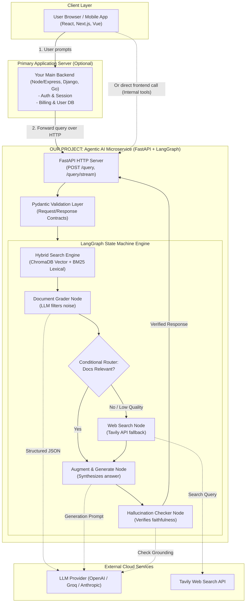

# 🧠 What Is This App, Actually? (Web Developer's Mental Model)

> **Quick Answer:** This app is an **Agentic AI Microservice** (or **Cognitive Inference Engine**).  
> It is **not** an AI Gateway, and it is **not** a traditional monolithic full-stack app.  
> In web development terms, it is a **specialized backend service** that exposes a REST/SSE API, receives a user question, runs an internal state machine (with data retrieval, evaluation, and fallback search), and streams back a verified answer.

---

## 1. Category Comparison: Where Does It Fit?

| Category | What It Does | Example in Web Dev | Is This Our Project? |
| :--- | :--- | :--- | :---: |
| **API / AI Gateway** | Proxies raw requests, handles rate-limiting, load balancing, model routing, and token cost tracking across LLM providers. | LiteLLM, Portkey, Kong, Cloudflare AI Gateway | ❌ **No.** A gateway doesn't hold application state or business logic. |
| **Fullstack App** | Includes UI (React, Vue), database (Postgres), business logic, auth, and styling in one repo. | Next.js full-stack app, Rails, Django app | ❌ **No.** We don't have a frontend UI baked into this core engine (though a UI can easily consume it). |
| **Traditional Backend** | CRUD operations, user authentication, relational database transactions. | Express.js + Prisma + PostgreSQL | ❌ **Partially, but incomplete.** It does have an HTTP server, but its logic isn't basic CRUD. |
| **Agentic AI Microservice** | A standalone HTTP service that orchestrates multi-step decision loops, hybrid search, self-correction, and LLM reasoning. | **Our CRAG Application** | ✅ **YES.** This is exactly what we are building. |

---

## 2. The Web Developer "Rosetta Stone" (Concept Translation)

If you know modern web development (TypeScript, Node, Express, React), here is how every single piece of this project maps 1:1 to concepts you already know:

| Web Dev / TypeScript Concept | CRAG Project Equivalent | What It Does Here |
| :--- | :--- | :--- |
| **Express.js / Fastify** | **FastAPI** | The HTTP web server that handles incoming requests (`POST /query`), manages routes, and streams Server-Sent Events (SSE). |
| **Zod / TypeScript Interfaces** | **Pydantic** | Validates incoming payloads at runtime, guarantees types, and forces LLMs to output strict, parseable JSON schemas instead of random text. |
| **XState / Temporal / Redux Saga** | **LangGraph** | A deterministic state machine. It manages state transitions: `Query -> Retrieve -> Grade -> (Decide) -> Generate -> Guardrail -> Respond`. |
| **Elasticsearch / Algolia** | **BM25 Retriever** | Keyword/exact match search (great for technical terms, part numbers, exact acronyms). |
| **Vector DB (pgvector / Pinecone)** | **ChromaDB** | Semantic search (great for fuzzy meanings, concepts, context similarity). |
| **External 3rd-Party API (Stripe, Twilio)** | **Tavily Search API** | External fallback API called dynamically when internal database search returns irrelevant junk. |

---

## 3. High-Level System Architecture Diagram

In a production web product, this service lives behind your frontend and main backend:



---

## 4. Why Isn't This An "AI Gateway"?

An **AI Gateway** (like Portkey, LiteLLM, or Cloudflare AI Gateway) is a **reverse proxy** for LLM calls:
- You send: `"What is Python?"` to the gateway.
- The gateway chooses between OpenAI vs Anthropic, tracks token usage, handles rate limiting, and forwards the raw completion back.
- **It has no memory, no state machine, no document retrieval, and no decision loop.**

**Our CRAG application is a business-logic service**:
- It doesn't just proxy calls; it **executes an algorithm**:
  1. Searches local documentation using hybrid embeddings + keyword algorithms.
  2. Evaluates its own retrieved documents like a human researcher would.
  3. Realizes: *"Wait, my internal docs don't answer this question — let me search Google/Tavily instead."*
  4. Generates an answer from the discovered evidence.
  5. Inspects its own generated answer to detect if it hallucinated before returning it to the user.

---

## 5. How A Web Developer Consumes This Service

Because we wrap the entire LangGraph workflow inside **FastAPI**, consuming it in frontend frameworks (Next.js, React) is identical to fetching from any Node.js API:

### Standard REST Query:
```typescript
// Next.js / React API call
const response = await fetch("http://localhost:8000/api/v1/query", {
  method: "POST",
  headers: { "Content-Type": "application/json" },
  body: JSON.stringify({
    question: "What is our company's refund policy?",
    enable_web_fallback: true
  })
});

const data = await response.json();
console.log(data.answer);
console.log(data.sources); // Documents or web links used
console.log(data.confidence_score);
```

### Real-Time Streaming (Server-Sent Events):
```typescript
// Real-time token streaming like ChatGPT
const eventSource = new EventSource(
  "http://localhost:8000/api/v1/query/stream?question=Explain+CRAG"
);

eventSource.onmessage = (event) => {
  const token = JSON.parse(event.data);
  process.stdout.write(token.text);
};
```

---

## 6. Summary: The 3 Core Responsibilities of This Service

1. **The Gateway to Knowledge (Ingestion & Hybrid Search):** Ingests private documents, builds vectors and keyword indices.
2. **The Autonomous Brain (LangGraph State Machine):** Coordinates the retrieval, grading, decision branching, and hallucination checking.
3. **The Web Interface (FastAPI + Pydantic):** Exposes typed endpoints, validates data, documents the API with Swagger/OpenAPI, and streams responses to your frontend.
